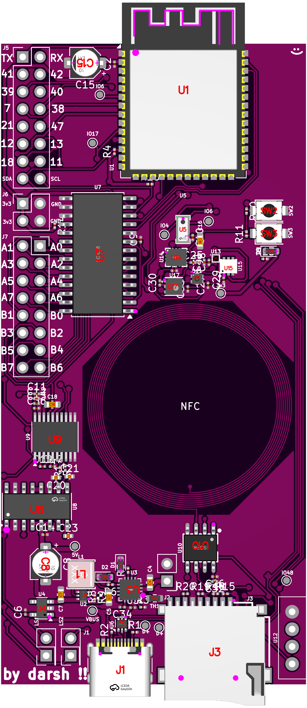
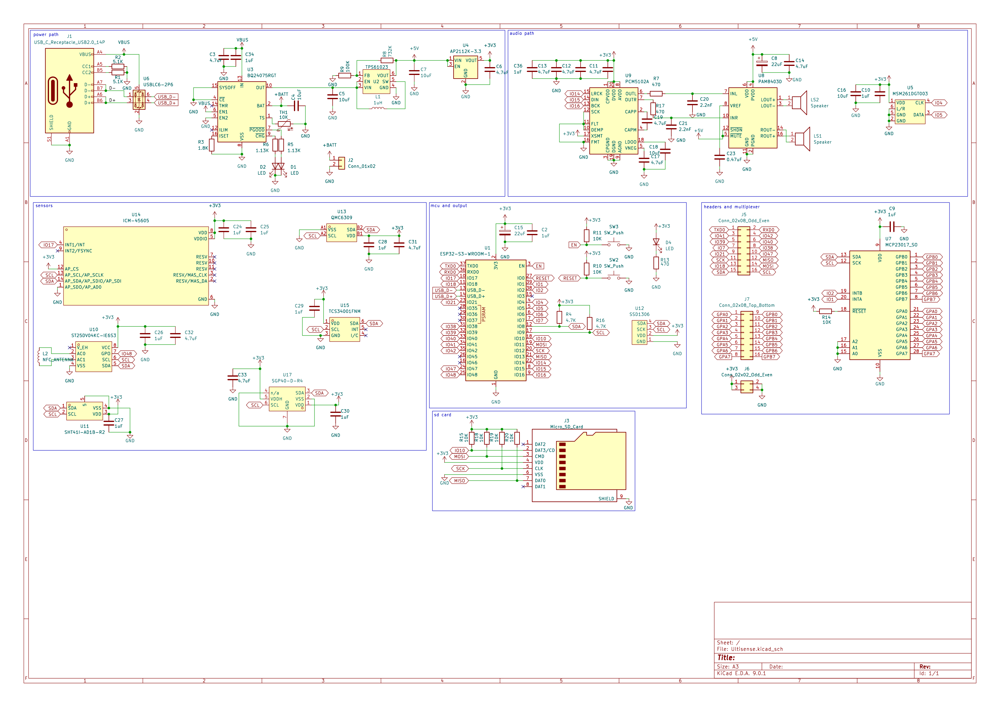

# Ultisense

an esp32-s3 devboard made to sense as many things as possible

has:
- an NFC antenna
- 6DOF IMU
- VOC air sensor
- humidity & temperature sensor
- color & ambient light sensor
- magnetometer

it additionally has:
- microphone
- two speakers
- microSD card

